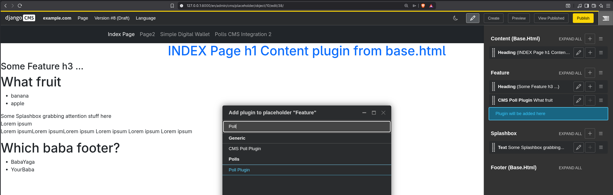

# Django CMS Tutorial Project



## Table of Contents

* [Setup](#setup)
* [Folder Structure](#folder-structure)
* [Theory](#theory)
* [Useful Commands](#useful-commands)
* [Screenshots](#screenshots)

## Setup

```bash
uv sync
```

```bash
tree -d -I "__pycache__|temporary|photos"
```

Delete useless files like the initialized requirements.txt, etc.

```bash
uv run src/manage.py migrate
```

```bash
uv run src/manage.py createsuperuser
```

```bash
uv run src/manage.py cms check
```

```bash
uv run src/manage.py runserver 8000
```

## Useful Commands

```bash
uv run src/manage.py startapp pages
```

```bash
uv run python -m directory_tree -I .venv node_modules __pycache__ data media static out temporary photos
```

```bash
cms list plugins
cms delete-orphaned-plugins
```

## Folder Structure

`tree -d -I "__pycache__|temporary|photos"`

```bash
.                                       # repo/project root
└─ src                                  # django project root; source root
  ├─ manage.py                          # django project management script                      
  └─ myproject                          # main django package (settings, urls, wsgi/asgi)
    ├── static                          # global static files (css, js, images)
    ├── templates                       # global html templates shared across apps
    └── contrib                         # django apps
       ├── cms_polls                    # cms app
       ├── polls                        # normal app
       ├── polls_cms_integration        # cms app that uses polls app
       │  ├── migrations                # database migrations for this app
       │  └── templates                 # app-specific templates
       │     └── polls_cms_integration  # folder for namespacing to avoid conflicts
       └── simple_digital_wallet        # cms app
```

## Theory

### CMS (Content Management System)

- What:  
  a system for creating, editing, organizing, and publishing website content through a user interface  
  usually provides pages, content blocks, media management, workflows, permissions, and previews
- Why: Non-technical users to manage content on a website.
- Examples: **Django CMS**, Strapi (JS Headless CMS), WordPress (PHP traditional CMS)

### Plugin

- What:  
  drag&drop, reusable, editable page fragments/content which will be managed by the editors
- Why: same as CMS
- Examples: poll widget, image gallery, form, card, banner, product teaser
- Consists of:
    - Plugin model [models.py](src/myproject/contrib/cms_polls/models.py)   
      stores data for a content block
      inherits from `CMSPlugin`
    - Plugin publisher [cms_plugins.py](src/myproject/contrib/cms_polls/cms_plugins.py)    
      tells the CMS how to render the content block  
      defines: name, plugin model  
      which template to use  
      how to prepare the context for the template  
      inherits from `CMSPluginBase`
- How it works:  
  When an editor clicks + in a placeholder:
  django CMS shows the list of registered plugins
  editor selects one
  django CMS creates a plugin instance in the database
  the plugin data is saved
  the chosen template renders it on the page

### CMS Page:

- What:  
  a page object managed by django CMS   
  usually has a title, slug, language versions, template, and placeholders  
  static content blocks  
  can also have advanced settings, such as an attached apphook  
  can be nested into a page tree, so the site structure is editable by content editors
- Why:  
  To give editors an entity that can be managed visually instead of being hardcoded  
  It is the basic container where CMS content, **placeholders**, aliases, **plugins**, and **apphooks** can live.
- How it works:  
  An editor creates a page in the CMS admin or toolbar  
  selects a template for it  
  adds content into placeholders  
  optionally attaches plugins or apphooks  
  django CMS then serves that page at its URL
- Examples:  
  home page, about page, contact page, poll page, blog page, product landing page

### CMS Tags

- ``  
  A page‑specific editable region where editors can insert plugins.
  It belongs to a single page and stores its content in the draft/public trees.
- ``  
  A **reusable** named content block that can be inserted into multiple pages.
- ``  
  A shared, globally editable placeholder‑like area that behaves like a normal placeholder but is not tied to a specific
  page.  
  Why:  
  Allows editors to manage shared content (e.g., header banners, footers, splash boxes) using the same drag‑and‑drop
  plugin interface as normal placeholders.  
  Unlike static_alias, this one supports full plugin editing, not just a single block of text.

### Apphook

- **What**: [cms_apps.py](src/myproject/contrib/polls_cms_integration/cms_apps.py)   
  An apphook is a configuration in which django app **URLs** are attached(hooked) to a CMS **page** so
  that the page becomes the **entry point** for that app
- Why:  
  reusability, flexibility
  Useful when you want editors to choose which CMS page should act as the entry point for an app.
- Examples: poll app, blog app, shop/catalog app, forum section

### models.py

- Place to define plugin models. How plugins will be stored in the database.

### cms_plugins.py

- Place to define plugin publishers. How plugins will be rendered on the page.

## Screenshots

- Polls
  
  


- Applied apphook to polls
  
