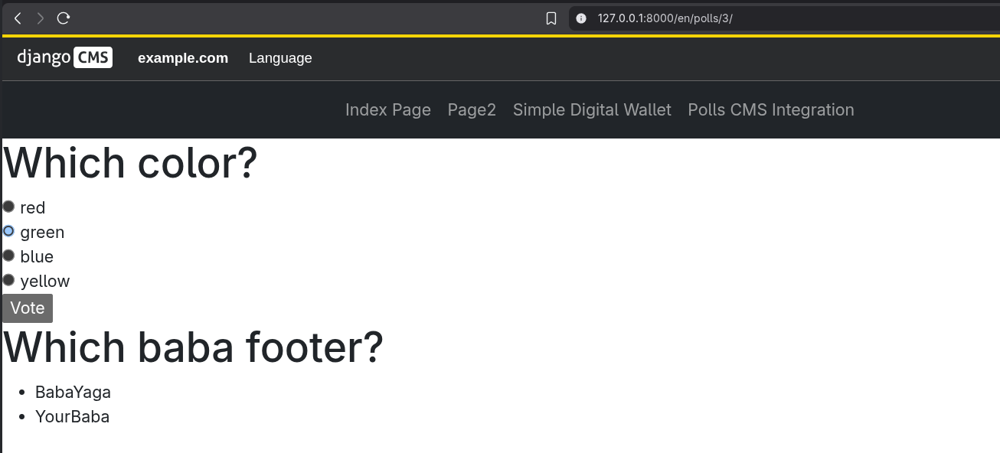
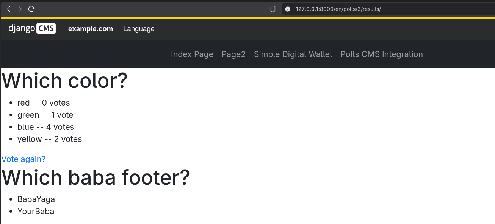
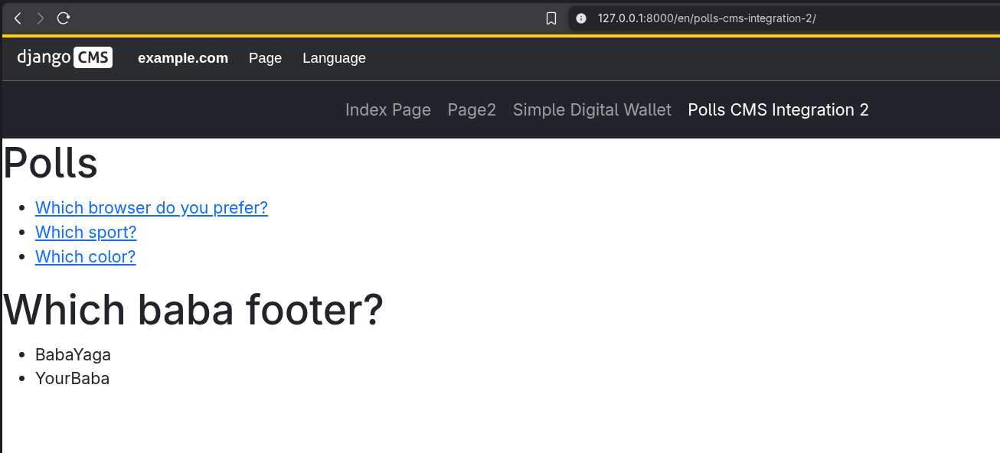

# Django CMS Tutorial



## Setup

```bash
uv sync
```

```bash
django-admin startproject myproject --template https://github.com/django-cms/cms-template/archive/5.1.tar.gz
```

Delete useless files like the initialized requirements.txt, etc.

```bash
uv run src/manage.py migrate
```

```bash
uv run src/manage.py createsuperuser
```

```bash
uv run src/manage.py cms check
```

```bash
uv run src/manage.py runserver 8000
```

## Useful Stuff

```bash
uv run src/manage.py startapp pages
```

```bash
uv run python -m directory_tree -I .venv node_modules __pycache__ data media static out temporary
```

```bash
cms list plugins
cms delete-orphaned-plugins
```

## Screenshots

- Polls
  
  


- Applied apphook to polls
  